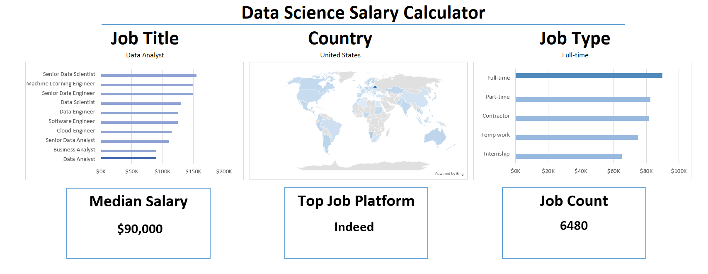

# Data-Science-Dashboard.Excel




## 📘 Introduction

This **Data Jobs Salary Dashboard** was created to help job seekers explore salary trends and ensure they're being fairly compensated.

The data comes from my Excel course, which teaches foundational skills in data analysis using Excel. This dashboard provides insights into real-world **data science job salaries** from 2023, including detailed information about:

- 👨‍💼 Job Titles  
- 💰 Salaries  
- 📍 Locations  
- 🛠️ Skills  


---

## 🧠 Excel Skills Used

This project demonstrates the use of several key Excel features:

📉 **Charts**  
🧮 **Formulas and Functions**  
❎ **Data Validation**

---

## 🗂️ Data Jobs Dataset

The dataset includes real-world **data science job listings from 2023**, with details such as:

- 👨‍💼 Job titles (e.g., Data Scientist, Data Analyst, Data Engineer)
- 💰 Annual salaries
- 📍 Geographic locations
- 🛠️ Required skills and schedule types

---

## 📈 Dashboard Breakdown

### 📉 Bar Chart: Data Science Job Salaries


🛠️ **Excel Features Used:** Bar chart with formatted salary values, optimized layout  
🎨 **Design Choice:** Horizontal bar chart for easy visual comparison  
📉 **Data Organization:** Sorted by descending median salary  
💡 **Insights Gained:** Senior roles and Engineers earn more than Analysts  

---

### 🌎 Map Chart: Country Median Salaries


🛠️ **Excel Features Used:** Map chart functionality  
🎨 **Design Choice:** Color-coded map to differentiate salary levels globally  
📊 **Data Representation:** Median salary per country with available data  
👁️ **Visual Enhancement:** Clear view of global salary disparities  
💡 **Insights Gained:** Identify high and low salary regions at a glance  

---

## 🧮 Formulas & Functions

### 💰 Calculating Median Salary by Job Title

```excel
=MEDIAN(
    IF(
        (jobs[job_title_short]=A2)*
        (jobs[job_country]=country)*
        (ISNUMBER(SEARCH(type,jobs[job_schedule_type])))*
        (jobs[salary_year_avg]<>0),
        jobs[salary_year_avg]
    )
)
```

🔍 **Multi-Criteria Filtering:** Filters by job title, country, schedule type, and excludes blank salaries  
📊 **Array Formula:** Uses `MEDIAN()` with nested `IF()` logic  
🎯 **Tailored Insights:** Calculates specific median salaries based on filters  
🔢 **Purpose:** Populates dynamic salary tables in the dashboard

---

### ⏰ Count of Unique Job Schedule Types

```excel
=FILTER(J2#,
    (NOT(ISNUMBER(SEARCH("and",J2#)) + ISNUMBER(SEARCH(",",J2#)))) *
    (J2#<>0)
)
```

🔍 **Unique List Generation:** Filters out unwanted strings like `"and"` and commas  
🔢 **Purpose:** Generates a clean list of unique job schedule types  

---

## ❎ Data Validation

🔒 **Enhanced User Input Control:**  
Used filtered lists as **data validation rules** under **Job Title**, **Country**, and **Type** options in the Data tab.

🎯 Ensures:
- ✅ User input is restricted to valid options  
- 🚫 Prevents incorrect or inconsistent entries  
- 👥 Improves overall usability and interactivity of the dashboard  

